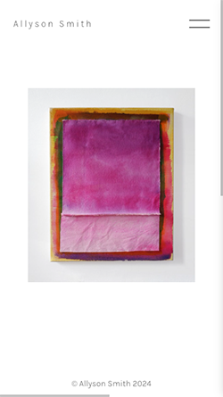
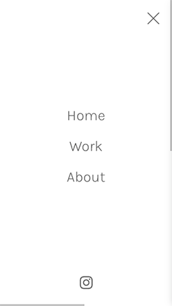
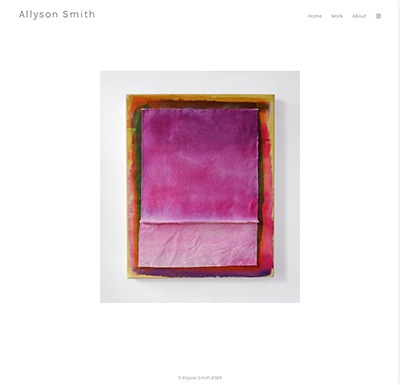
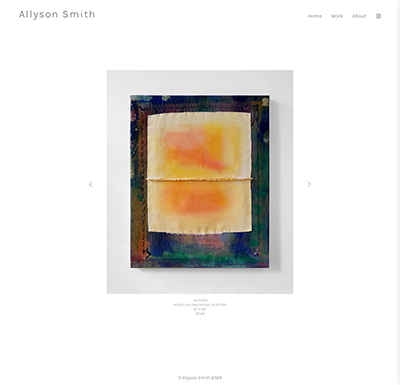

# Allyson Smith Art Portfolio

## Table of contents

- [Overview](#overview)
  - [About](#About)
  - [Screenshot](#screenshot)
  - [Links](#links)
- [My process](#my-process)
  - [Built with](#built-with)
  - [What I learned](#what-i-learned)
  - [Continued development](#continued-development)
  - [Useful resources](#useful-resources)
- [Author](#author)

## Overview

### About

This is an art portfolio website with the goal of providing a clean, minimal design to allow the art work to be the focus.  I used React Slick Slider for a gallery carousel component after trying out a few other options such as React Image Gallery and Cloudinary's Product Gallery.  I appreciated the simplicity and ease of use of React Slick and the ability to easily create slide components with an image and text description underneath.  

I ended up using a local json file for the image data because I needed a site up in a hurry and there was only a handful of images.  As the data grows and with more time for the project I plan on using more of Cloudinary's capabilities and to connect via API.  I was easily able to connect to my Cloudinary image hosting for the single image I used in the home page but need to spend more time connecting to the Admin API to get the gallery's full image folder and utilizing the structured metadata for displaying descriptions.  I read in a Cloudinary support answer that this is best done through the backend and not the frontend as I was initially trying.

The goals:

- View the optimal layout for the site depending on their device's screen size
- Provide a portfolio for my most recent art work and contact info

### Screenshot

### Links

- Live Site URL: [https://allysonsmithstudio.com/](https://allysonsmithstudio.com)
- Live Site URL: [https://allyson-smith-studio.netlify.app](https://allyson-smith-studio.netlify.app)

## My process

### Built with
- React
- React Slick Slider
- CSS 
- Mobile-first workflow
- Cloudinary
- Netlify

## Useful Resources

- React Slick - (https://react-slick.neostack.com/)
- CLoudinary - (https://cloudinary.com/documentation/dam_manage_metadata)
- Fetching Metadata from Cloudinary - (https://stackoverflow.com/questions/76435121/fetch-file-metadata-from-cloudinary-using-node-js-sdk)
- React Router - (https://www.linkedin.com/pulse/react-router-step-by-step-guide-luqman-shaban-gmfvf/)
- Creat React App - see below

This project was bootstrapped with [Create React App](https://github.com/facebook/create-react-app).

## Available Scripts

In the project directory, you can run:

### `npm start`

Runs the app in the development mode.\
Open [http://localhost:3000](http://localhost:3000) to view it in your browser.

The page will reload when you make changes.\
You may also see any lint errors in the console.

### `npm test`

Launches the test runner in the interactive watch mode.\
See the section about [running tests](https://facebook.github.io/create-react-app/docs/running-tests) for more information.

### `npm run build`

Builds the app for production to the `build` folder.\
It correctly bundles React in production mode and optimizes the build for the best performance.

The build is minified and the filenames include the hashes.\
Your app is ready to be deployed!

See the section about [deployment](https://facebook.github.io/create-react-app/docs/deployment) for more information.

### `npm run eject`

**Note: this is a one-way operation. Once you `eject`, you can't go back!**

If you aren't satisfied with the build tool and configuration choices, you can `eject` at any time. This command will remove the single build dependency from your project.

Instead, it will copy all the configuration files and the transitive dependencies (webpack, Babel, ESLint, etc) right into your project so you have full control over them. All of the commands except `eject` will still work, but they will point to the copied scripts so you can tweak them. At this point you're on your own.

You don't have to ever use `eject`. The curated feature set is suitable for small and middle deployments, and you shouldn't feel obligated to use this feature. However we understand that this tool wouldn't be useful if you couldn't customize it when you are ready for it.

## Learn More

You can learn more in the [Create React App documentation](https://facebook.github.io/create-react-app/docs/getting-started).

To learn React, check out the [React documentation](https://reactjs.org/).

### Code Splitting

This section has moved here: [https://facebook.github.io/create-react-app/docs/code-splitting](https://facebook.github.io/create-react-app/docs/code-splitting)

### Analyzing the Bundle Size

This section has moved here: [https://facebook.github.io/create-react-app/docs/analyzing-the-bundle-size](https://facebook.github.io/create-react-app/docs/analyzing-the-bundle-size)

### Making a Progressive Web App

This section has moved here: [https://facebook.github.io/create-react-app/docs/making-a-progressive-web-app](https://facebook.github.io/create-react-app/docs/making-a-progressive-web-app)

### Advanced Configuration

This section has moved here: [https://facebook.github.io/create-react-app/docs/advanced-configuration](https://facebook.github.io/create-react-app/docs/advanced-configuration)

### Deployment

This section has moved here: [https://facebook.github.io/create-react-app/docs/deployment](https://facebook.github.io/create-react-app/docs/deployment)

### `npm run build` fails to minify

This section has moved here: [https://facebook.github.io/create-react-app/docs/troubleshooting#npm-run-build-fails-to-minify](https://facebook.github.io/create-react-app/docs/troubleshooting#npm-run-build-fails-to-minify)

## Author

- Dev Portfolio - [Allyson Smith](https://smithstudio.dev)
- Github - [@allyson-s-code](https://github.com/allyson-s-code)